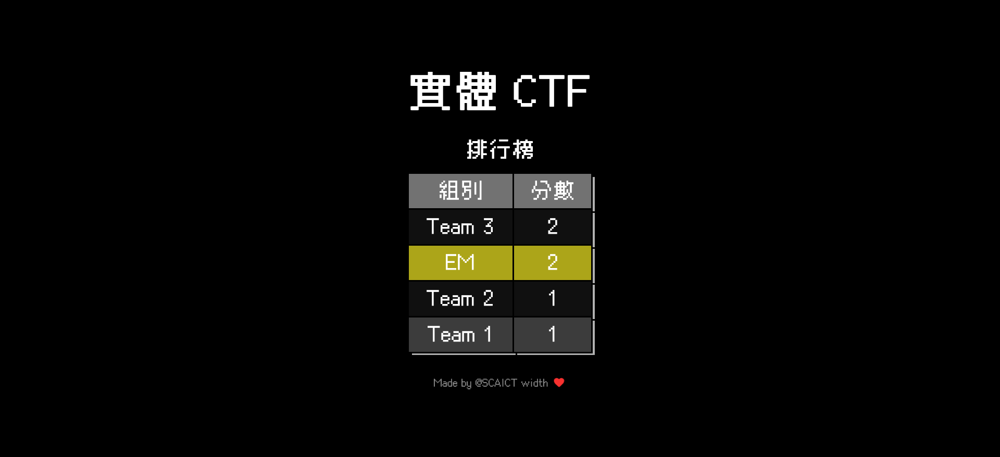
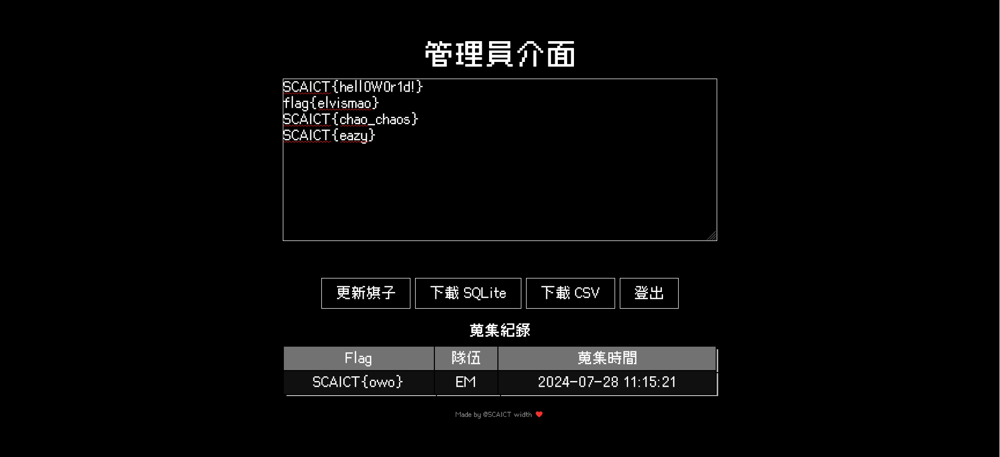

#  Physical CTF

大地遊戲實體 Flag 回報網站。平常 Code 太久，該出去摸草了。

> English version of this document is available [here](README.md).

[](https://zeabur.com/templates/1IW0VW?referralCode=Edit-Mr)



歡迎使用 Physical CTF 回報網站。這個網頁應用程式讓用戶可以提交和蒐集旗子 (flags)，並且在後台管理旗子。本文檔將引導你完成安裝、配置、使用以及管理旗子的步驟。

這個遊戲通常的玩法是印出數個帶有 QRCode 的旗子（通常使用 A4 紙列印並黏貼在竹筷上），然後關主或是兩隊互相將旗子藏在指定範圍內的角落。於時間內搜集最多旗子的隊伍獲勝。

以下是正常的連結格式：

```bash
https://<你的網域>.com/flag?flag=<旗子>
```

如 https://flag.scaict.org/flag?flag=flag{iL0veSCAICT}

## 目錄

1. [安裝](#安裝)
2. [配置](#配置)
3. [使用說明](#使用說明)
4. [後台管理](#後台管理)
5. [API 端點](#API-端點)

## 安裝

> 可點擊 "Deploy on Zeabur" 按鈕來快速部署到 Zeabur 平台。
> 
> [](https://zeabur.com/templates/1IW0VW?referralCode=Edit-Mr)

在開始之前，請確保你已經安裝了 [Node.js](https://nodejs.org/) 和 [npm](https://www.npmjs.com/)。然後，請按照以下步驟進行安裝：

1. 克隆項目：
    ```bash
    git clone https://github.com/SCAICT/physical-flag.git
    cd physical-flag
    ```

2. 安裝依賴：
    ```bash
    npm install
    ```

## 配置

在項目根目錄下創建一個 `.env` 文件，並添加以下內容來配置管理密碼：

```
ADMIN_PASSWORD=yourpassword
SECRET=yoursecret
```

將 `yourpassword` 替換為你希望使用的管理密碼，將 `yoursecret` 替換為一個隨機的字串。

## 使用說明

1. 啟動伺服器：
    ```bash
    npm start
    ```

2. 在瀏覽器中訪問 `http://localhost:3000` 查看應用程式首頁。

### 提交旗子

用戶可以通過表單提交旗子。提交的旗子將被驗證是否存在於資料庫中，如果存在且未被當前用戶蒐集過，將被記錄下來。

## 後台管理



管理員可以通過管理後台頁面來添加和刪除 flags。

1. 在瀏覽器中訪問 `http://localhost:3000/admin` 進入管理頁面。
2. 輸入管理密碼。
3. 在 textarea 中添加或刪除 flags（每行一個）。
4. 點擊 "Update Flags" 按鈕保存更改。

### 範例

```plaintext
flag{new_flag_1}
flag{new_flag_2}
flag{new_flag_3}
```

提交後，這些 flags 將被添加到資料庫中。

## API 端點

### GET `/`

顯示首頁。

### GET `/list`

返回用戶蒐集旗子的排行榜。

範例響應：
```json
[
    {"user": "Alice", "score": 3},
    {"user": "Bob", "score": 2}
]
```

### GET `/flag`

顯示旗子提交頁面。

### POST `/sendFlag`

提交旗子。

請求體：
```json
{
    "flag": "SCAICT{example_flag}",
    "username": "Alice"
}
```

範例響應：
```plaintext
Alice 成功蒐集 SCAICT{example_flag}
```

### GET `/admin`

顯示管理頁面。

### POST `/admin`

更新 flags。

請求體：
```json
{
    "password": "yourpassword",
    "flags": "SCAICT{new_flag_1}\nSCAICT{new_flag_2}\nSCAICT{new_flag_3}"
}
```

範例響應：
```plaintext
Flags updated successfully
```

# 授權

本項目採用 Apache-2.0 授權。詳情請參閱 [LICENSE](LICENSE) 文件。